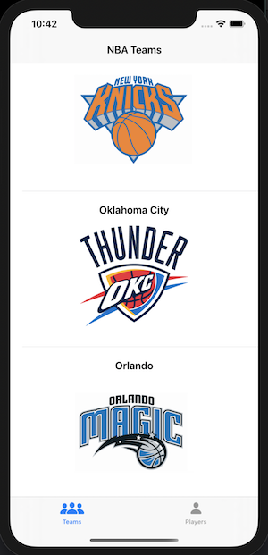
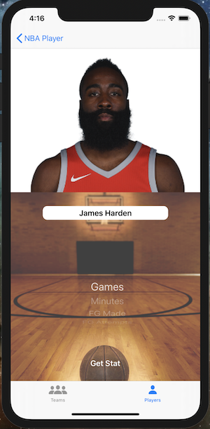

# NBAteams-app

## Description

This App is designed to display all teams in the NBA, as well as load the schedule for a selected team for the 2019-2020 season. In a separate tab in the app, the user can search for a player and see the player's stats for the season. One feature this app includes is the ability to come up for a predicted number of points the selected player will score in their next upcoming game. This prediction is based on the player's season average, how well they've been performing in the previous 7 games, and the strength of the upcoming opposition's defense. The code below shows this.

## Code Snippet

```swift
private func getPredictedPoints() {
        
        guard let playerId = player?.id else {
            showAlert(title: "Error", message: "Could not get player id.")
            return
        }
        
        PlayerAPIClient.getStatsDated(for: playerId, startDate: getDateLastWeek(), endDate: date) { [weak self] (result) in
            switch result {
            case .failure(let appError):
                DispatchQueue.main.async {
                    self?.showAlert(title: "Error", message: "\(appError)")
                }
            case .success(let stats):
                DispatchQueue.main.async {
                    
                    for stat in stats {
                        if stat.pts != 0 {
                            self?.weekPtAvg += stat.pts
                            self?.count += 1
                        }
                    }
                    
                    guard let week = self?.weekPtAvg, let count = self?.count, let season = self?.seasonAvg, let oppTeam = self?.opposition, let fireTeams = self?.goodTeams, let badTeams = self?.trashTeams else {
                        return
                    }
                    
                    let avg = (week / count)
                    var seasonWeek = (season + avg) / 2
                    self?.weekSeason = seasonWeek
                    
                    switch season {
                    case 30...:
                        if fireTeams.contains(oppTeam) {
                            seasonWeek -= 5
                        } else if badTeams.contains(oppTeam) {
                            seasonWeek += 7
                        }
                    case 25...30:
                        if fireTeams.contains(oppTeam) {
                            seasonWeek -= 3
                        } else if badTeams.contains(oppTeam) {
                            seasonWeek += 5
                        }
                    case 20...25:
                        if fireTeams.contains(oppTeam) {
                            seasonWeek -= 2
                        } else if badTeams.contains(oppTeam) {
                            seasonWeek += 4
                        }
                    case 15...20:
                        if fireTeams.contains(oppTeam) {
                            seasonWeek -= 2
                        } else if badTeams.contains(oppTeam) {
                            seasonWeek += 2
                        }
                    default:
                        self?.trustPointsLabel.text = "Good For...\((String(format: "%.0f", seasonWeek)))"
                    }
                    
                    self?.trustPointsLabel.text = "Good For...\((String(format: "%.0f", seasonWeek)))"
                    
                }
            }
        }
    }
```

## ScreenShot of App





## GIF


